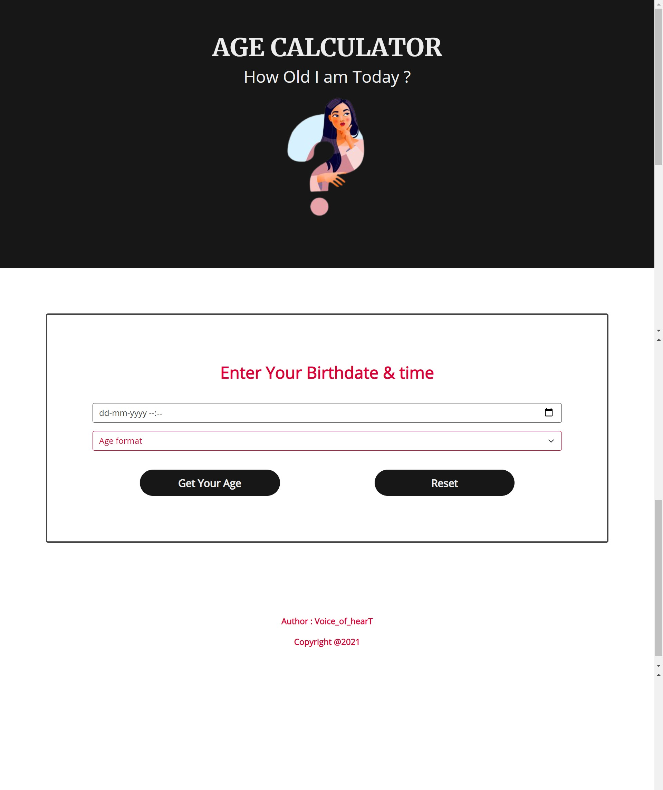

# Age_calculator
How old am I today ?

## Table of contents

- [Overview](#overview)
- [Screenshot](#screenshot)
- [Links](#links)
- [My process](#my-process)
- [Built with](#built-with)
- [What I learned](#what-i-learned)
- [Continued development](#continued-development)
- [Useful resources](#useful-resources)
- [Author](#author)

## Overview
Age calculator : calculates the age upto current date
- in full format
- in years
- in months
- in days
- in hours
- in minutes

### Screenshot
## desktop

## mobile


### Links

- Solution URL: [https://github.com/mansi05041/Age_calculator]
- Live Site URL: [https://age-calculator-gii3nfxwi-mansi05041.vercel.app/]

## My process

To make website i used Bootstrap for form input.

### Built with

- Semantic HTML5 markup
- CSS custom properties
- Javascript
- Mobile-first workflow
- Bootstrap

### What I learned

```js
function reset(){
  window.location.reload();
  location.href = "#form";
}
```
jqeury for implementing refresh of web page

### Continued development

Improvement in Responsive Area.

### Useful resources

- [w3schools](https://www.w3schools.com/css/css_rwd_mediaqueries.asp) - This helped me for understanding the media querry.
- [MDN](https://developer.mozilla.org/en-US/) - This is helpful in implementation of javascript.
- [Bootstrap](https://getbootstrap.com/) - This helped in form input.

## Author

- Frontend Mentor - [@mansi05041](https://www.frontendmentor.io/profile/mansi05041)
- Linkedin - [mansi joshi](https://www.linkedin.com/in/mansi-joshi-663aa81a0/)
